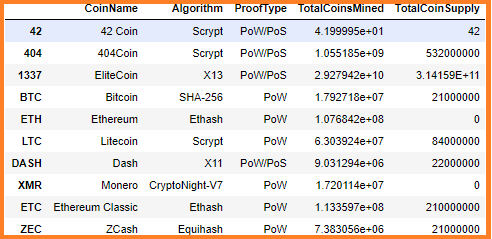
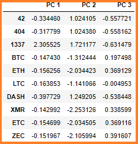
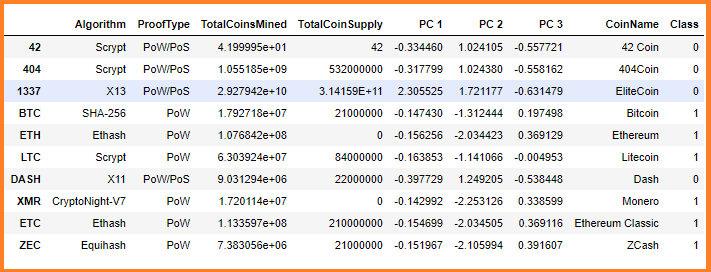
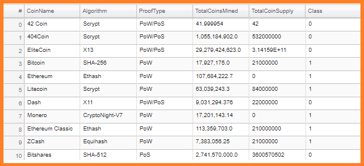
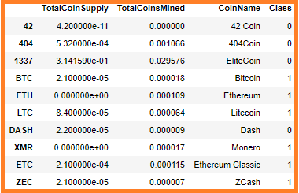
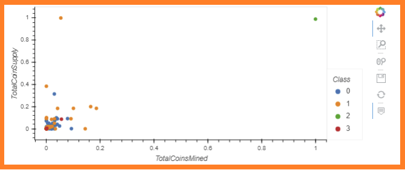

# Cryptocurrencies
New project on Cryptocurrencies analysis. An analysis for clients who are preparing to get into the cryptocurrency market.

## Project Overview
Working with Accountability Accounting to offer a new cryptocurrency investment portfolio to its customers. The company, however, is lost in the vast universe of cryptocurrencies. They have asked to create a report that includes what cryptocurrencies are on the trading market and how they could be grouped to create a classification system for this new investment. To prepare this report, four (4) technical analysis will be delivered. They are:

- Deliverable 1: Preprocessing the Data for PCA
- Deliverable 2: Reducing Data Dimensions Using PCA
- Deliverable 3: Clustering Cryptocurrencies Using K-means
- Deliverable 4: Visualizing Cryptocurrencies Results

## Purpose
The purpose of this project is to process the data to fit the machine learning models that includes the use of unsupervised learning to dertmaine the output as well as  as well as using a clustering algorithim to group the cryptocurrencies. Data visualizations will be used to share the findings with the board.

## Resources
- **Data Source:** `crypto_data.csv`, `crypto_clustering.ipynb`
- **Software:** `VS Code`, `Jupyter Notebook`, `Anaconda`, `GitHub`

## Cryptocurrencies Results
>
### Crypto_df dataframe
>
>**Image showing the `crypto_df` dataframe:**
>
>
>
### pcs_d dataframe
>
>**Image showing the `pcs_d` dataframe:**
>
>
>
### Clustered_df dataframe
>
>**Image showing the `clustered_df` dataframe:**
>
>
>
### Tradable cryptocurrencies
>
>**Image showing a table with tradable cryptocurrencies:**
>
>
>
### New `clustered_df` dataframe
>
>**Image showing the new `clustered_df` dataframe with the `class` column added:**
>
>
>
### hvplot scatter plot
>
>**Image showing an `hvplot` scatter plot with x="TotalCoinsMined", y="TotalCoinSupply", and by="Class:**
>
>